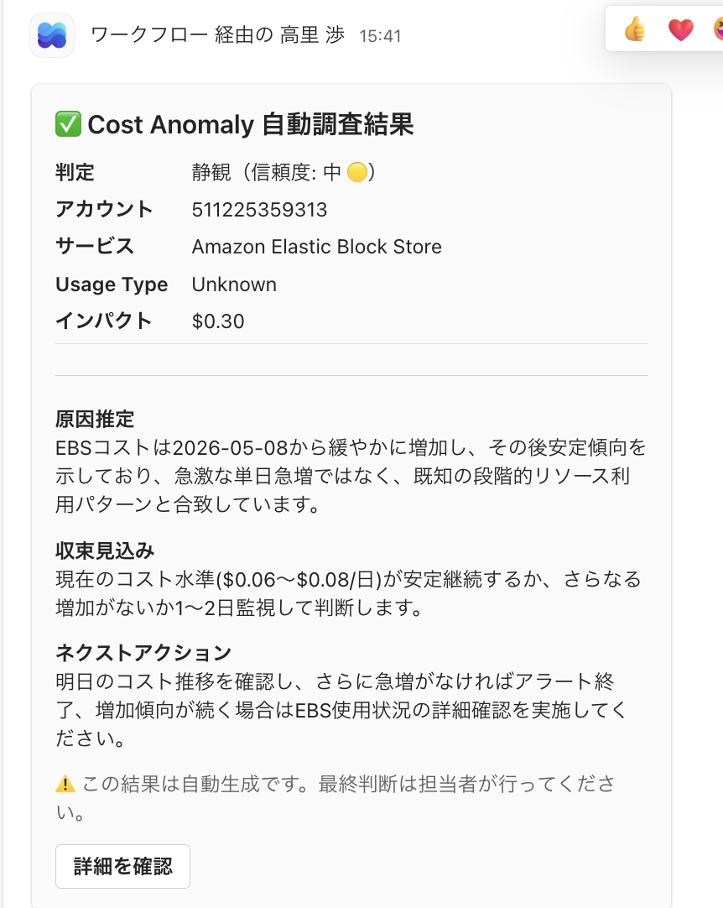
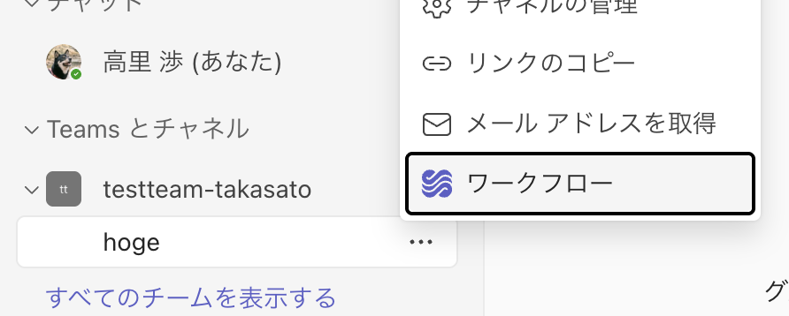
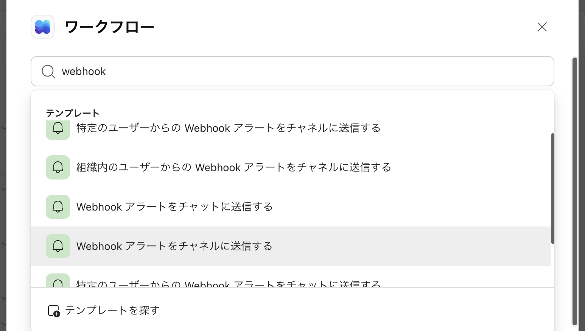

# Cost Anomaly Triage (Bedrock edition)

> **Opsmethod 2026 登壇資料サンプルコード**
> 「AWS のコスト異常は気づくのにもコストがかかる - 調査 1 時間を自動化する」

AWS Cost Anomaly Detection のアラートを受信すると、Lambda が自動で原因を調査し
**「静観 / 要対応」の判定 + 理由 + ネクストアクション** を Slack / Teams に通知します。
LLM には **Amazon Bedrock 上の Claude Haiku 4.5** を使用しています（外部 API キー不要）。

---

## アーキテクチャ

```
Cost Anomaly Detection
    │
    │ EventBridge ルール (us-east-1 のみ)
    ↓
Lambda: cost-anomaly-triage
    ├─ Cost Explorer API        → 過去 14 日のコスト推移を自動取得
    └─ Bedrock (Claude Haiku 4.5) → 原因推定・判定・ドラフト生成
    │
    ↓
Slack / Teams 通知（判定 + 理由 + ネクストアクション）
   ├─ 失敗時は DLQ (SQS) に退避
   └─ EventBridge 側で最大 2 回リトライ
```

---

## 事前準備

| 必要なもの | 取得方法 |
|---|---|
| AWS CLI（設定済み） | `aws configure` |
| AWS SAM CLI | https://docs.aws.amazon.com/serverless-application-model/latest/developerguide/install-sam-cli.html |
| Bedrock のモデルアクセス（Claude Haiku 4.5） | [AWS コンソール → Bedrock → Model access](https://us-east-1.console.aws.amazon.com/bedrock/home?region=us-east-1#/modelaccess) で有効化 |
| Slack Incoming Webhook URL | Slack App → Incoming Webhooks |
| Teams Incoming Webhook URL（任意） | Microsoft Teams → コネクタ |

---

## デプロイ

リポジトリをクローンして、お使いの OS に合わせてスクリプトを実行してください。
Webhook URL は対話入力で SSM Parameter Store（SecureString）に登録されます。

### macOS / Linux

```bash
git clone https://github.com/<your-account>/cost-anomaly-triage
cd cost-anomaly-triage
chmod +x deploy.sh
./deploy.sh
```

### Windows (PowerShell)

```powershell
git clone https://github.com/<your-account>/cost-anomaly-triage
cd cost-anomaly-triage
./deploy.ps1
```

> **us-east-1 に固定されています**
> Cost Anomaly Detection の EventBridge イベントは `us-east-1` のみで発行されます。

---

## 動作確認（サンプルイベントで即テスト）

デプロイ後、実際のアラートを待たずにサンプルイベントで動作確認できます。

### macOS / Linux

```bash
aws lambda invoke \
  --function-name cost-anomaly-triage-dev \
  --payload file://tests/sample_event.json \
  --cli-binary-format raw-in-base64-out \
  --region us-east-1 \
  /tmp/output.json && cat /tmp/output.json
```

### Windows (PowerShell)

```powershell
aws lambda invoke `
  --function-name cost-anomaly-triage-dev `
  --payload file://tests/sample_event.json `
  --cli-binary-format raw-in-base64-out `
  --region us-east-1 `
  output.json ; Get-Content output.json
```

`tests/sample_event.json` には GuardDuty の PaidS3DataEventsAnalyzed 異常のサンプルが入っています。

---

## Slack 通知イメージ

```
🚨 Cost Anomaly 自動調査結果

アカウント       サービス
123456789012    Amazon GuardDuty

Usage Type                    インパクト
APN1-PaidS3DataEventsAnalyzed  $161.49

──────────────────────────────
判定: 要対応  ／  信頼度: high 🟢

原因推定
S3 データイベントのモニタリング対象バケットが急増、
または特定バケットへの異常アクセスが発生している可能性があります。

収束見込み
対象バケットの GuardDuty S3 保護設定を確認・修正後に収束見込み。

ネクストアクション
GuardDuty コンソールで対象バケットと発生イベント種別を特定し、
不要な S3 イベントモニタリングを無効化してください。
──────────────────────────────
⚠️ この結果は自動生成です。最終判断は担当者が行ってください。
```

---

## Teams 通知イメージ

Teams Incoming Webhook URL を登録した場合、Slack と同じ内容が Teams にも通知されます。



---

## ファイル構成

```
cost-anomaly-triage/
├── template.yaml          # SAM テンプレート (CFn)
├── src/
│   ├── handler.py         # Lambda 関数本体
│   └── prompts/
│       └── triage.txt     # Bedrock 用プロンプトテンプレート
├── tests/
│   └── sample_event.json  # テスト用サンプルイベント
├── deploy.sh              # ワンコマンドデプロイ (macOS / Linux)
├── deploy.ps1             # ワンコマンドデプロイ (Windows PowerShell)
├── destroy.sh             # リソース削除 (macOS / Linux)
├── destroy.ps1            # リソース削除 (Windows PowerShell)
└── README.md
```

---

## カスタマイズポイント

### 判断基準を追加したい場合
`src/prompts/triage.txt` のプロンプトを編集してください。

### Teams への通知も有効にしたい場合
`deploy.sh` / `deploy.ps1` の対話入力で Teams Incoming Webhook URL を登録すると、
Slack と同じ内容が Teams にも通知されます。スキップした場合は Slack のみに通知されます。

#### Teams Incoming Webhook URL の取得手順

Microsoft 365 の仕様変更により、Teams の Incoming Webhook は **ワークフロー (Power Automate)** から作成します。

1. 通知先チャネルの「…」メニューから **ワークフロー** を選択

   

2. 検索ボックスに `webhook` と入力し、テンプレート **「Webhook アラートをチャネルに送信する」** を選択

   

3. ウィザードを進めて作成完了後に表示される **Webhook URL** をコピーし、デプロイスクリプトの対話入力で登録します。

### Asana 自動起票（フェーズ 2）
`src/handler.py` の `_post_to_slack()` の後に Asana REST API 呼び出しを追加することで、
「要対応」判定時に自動でサブタスクを起票できます。

---

## 削除方法

デプロイ時と同様にスクリプトを実行してください。CloudFormation スタック / SSM パラメーター /
デプロイ用 S3 バケットをまとめて削除します。

### macOS / Linux

```bash
./destroy.sh
```

### Windows (PowerShell)

```powershell
./destroy.ps1
```

---

## ライセンス

MIT
